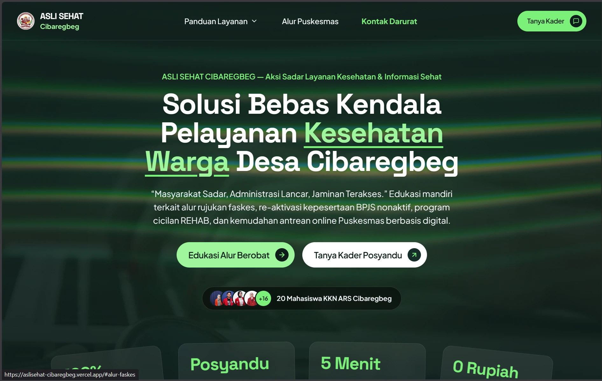

# ASLI SEHAT CIBAREGBEG

> **Aksi Sadar Layanan Kesehatan & Informasi Sehat**  
> *“Masyarakat Sadar, Administrasi Lancar, Jaminan Terakses.”*

Portal edukasi mandiri mengenai alur pelayanan BPJS Kesehatan dan Puskesmas untuk warga Desa Cibaregbeg, Kec. Cibeber, Kab. Cianjur. 

Inisiatif ini disusun dan dikembangkan oleh **Tim Mahasiswa KKN S1 Administrasi Rumah Sakit (ARS) Universitas Indonesia Maju (UIMA) Periode 2026** guna meningkatkan literasi administrasi kesehatan dan mempermudah akses layanan fasilitas kesehatan bagi masyarakat desa.

---

## 📌 Ringkasan Layanan & Informasi

- **Klasifikasi Kepesertaan:** Edukasi jenis kepesertaan BPJS (PBI Bantuan Pemerintah, Mandiri/PBPU, dan Pekerja Penerima Upah/PPU).
- **Alur Pelayanan Faskes:** Panduan alur berobat mulai dari pendaftaran, poli pemeriksaan medis dokter, instalasi farmasi, hingga alur rujukan berjenjang ke rumah sakit.
- **Cakupan Layanan:** Informasi jenis tindakan medis dan pemeriksaan di Puskesmas yang ditanggung oleh BPJS Kesehatan.
- **Panduan Fitur Digital:** Petunjuk pemanfaatan Mobile JKN, pengambilan antrean online dari rumah, kartu KIS digital, dan skrining kesehatan.
- **Solusi Administrasi:** Informasi re-aktivasi kepesertaan nonaktif, program cicilan tunggakan (REHAB), serta prosedur pindah fasilitas kesehatan (FKTP).
- **Posko Edukasi & Narahubung:** Saluran komunikasi pendampingan bersama tim mahasiswa KKN di Posko Desa Cibaregbeg.

---

## 👥 Tim Pelaksana

- **Program:** Kuliah Kerja Nyata (KKN)
- **Institusi:** Program Studi S1 Administrasi Rumah Sakit, Fakultas Ilmu Kesehatan, Universitas Indonesia Maju (UIMA)
- **Lokasi:** Desa Cibaregbeg, Kec. Cibeber, Kab. Cianjur, Jawa Barat
- **Periode:** 2026
